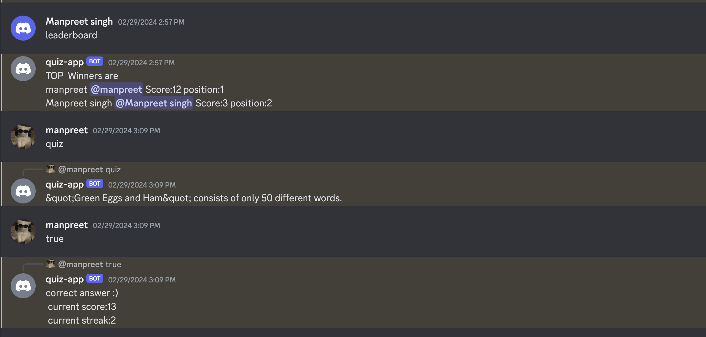

# Quiz Bot for Discord

This Discord bot is designed for hosting quizzes in Discord servers. It utilizes Discord.js for interacting with the Discord API and MongoDB for storing quiz data and leaderboard information.

## Features

- Quiz functionality with random true/false questions fetched from a JSON file.
- Correct answers earn 1 point, while incorrect answers earn 0 points.
- Streak feature: Users earn extra points for answering consecutive questions correctly.
- Leaderboard system to track users' scores, streaks, and positions.
- Commands for starting quizzes, answering questions, and checking the leaderboard.

## Tech Stack

- Discord.js for Discord bot interactions.
- MongoDB for storing quiz data and leaderboard information.
- Node.js for the backend environment.

## Contributing

Contributions are welcome! Please create a new branch and submit a pull request for any enhancements or bug fixes.

## License

This project is licensed under the [MIT License](/path/to/LICENSE).
